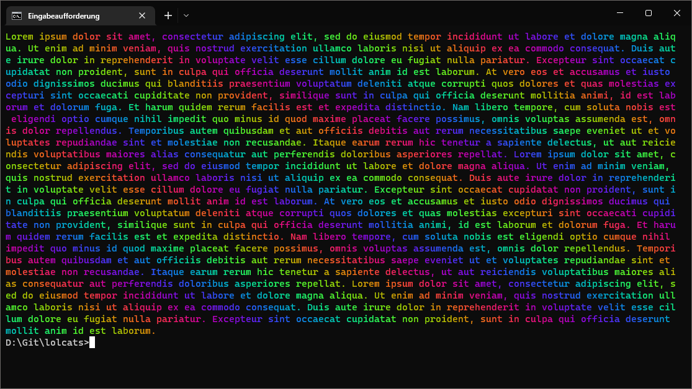

# lolcats

Bare minimum implementations of lolcat in different programming languages.

## Table of Contents

- [Screenshot](#screenshot)
- [Usage](#usage)
- [Included languages](#included-languages)

## Screenshot

Using [Lorem Ipsum](https://www.lipsum.com).



## Usage

Each variant prints the first given argument (e.g. Hello, World!) in rainbow colors.

```
$ ./lolcat "Hello, World!"
```

## Included languages

Each subfolder contains a README with details on how to build and run.

- [Ada](ada)
- [C](c)
- [C3](c3)
- [C++](cpp)
- [C#](csharp)
- [D](d)
- [Dart](dart)
- [Fortran](fortran)
- [Go](go)
- [Java](java)
- [JavaScript](javascript)
- [Kotlin](kotlin)
- [Lua](lua)
- [Nim](nim)
- [Objective-C](objective-c)
- [Pascal](pascal)
- [Perl](perl)
- [PHP](php)
- [Python](python)
- [Ruby](ruby)
- [Rust](rust)
- [Visual Basic](vb)
- [Zig](zig)